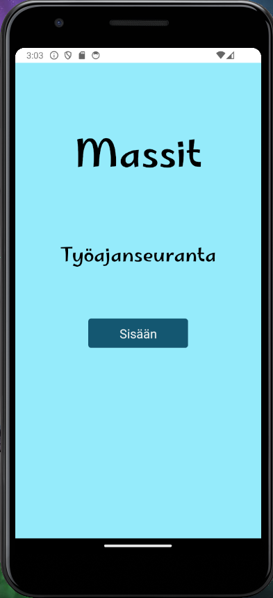
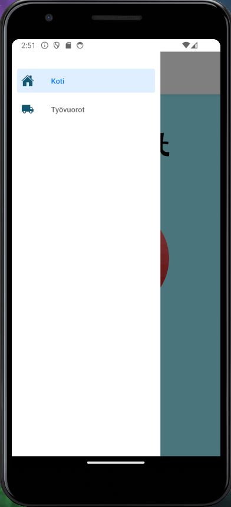

# Massit

"Massit" is a work time tracking application that allows users to start tracking work shifts and breaks during the shifts. From the "Work Shifts" page, users can view the completed work shifts and also remove shifts.

The application is built using React Expo, and the programming language used is JavaScript.

 

